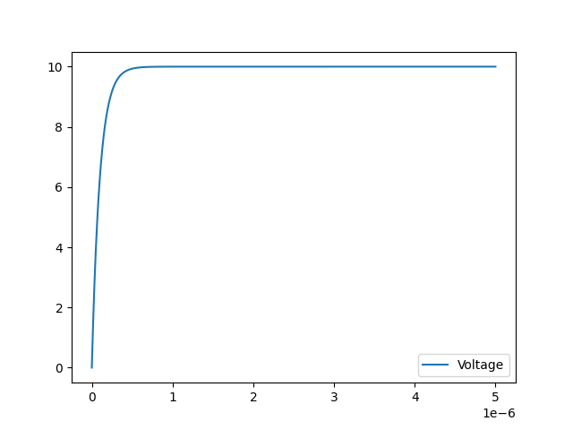
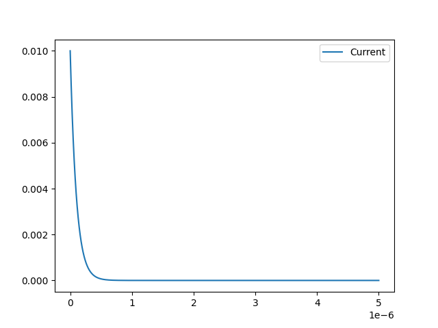

# Data analysis
This folder contain the additional work to evaluate the coherance of the data.

the python script **plot.py** read the value contained in the file **data.txt** created in the main.cpp with the function **saveCapacitor**.
There are the final shape of the current and the voltage:
## Voltage in the capacitor

## Current in the capacitor
